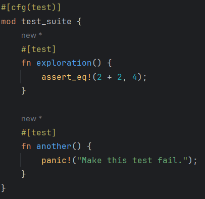
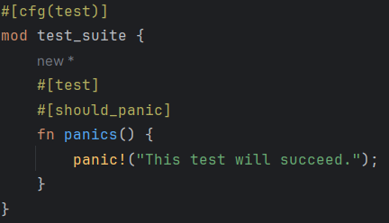
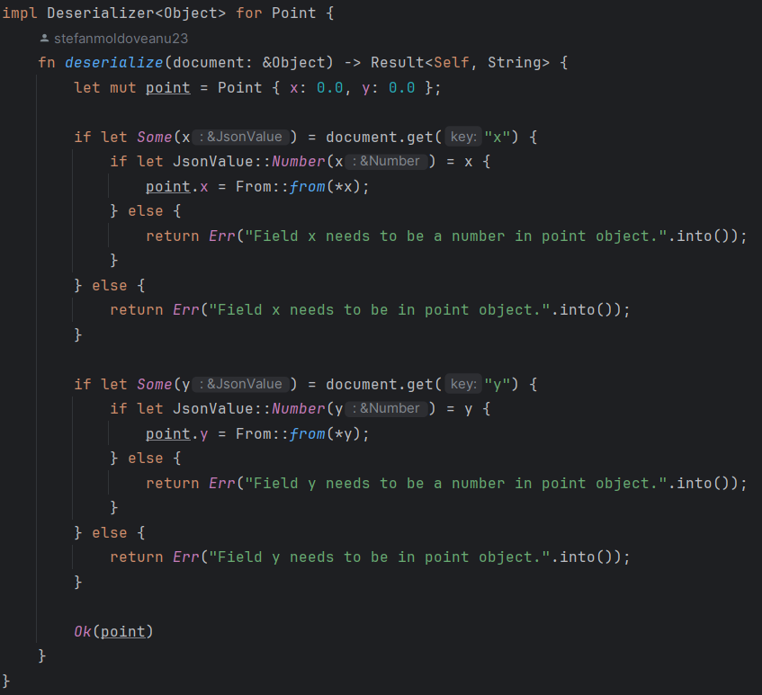
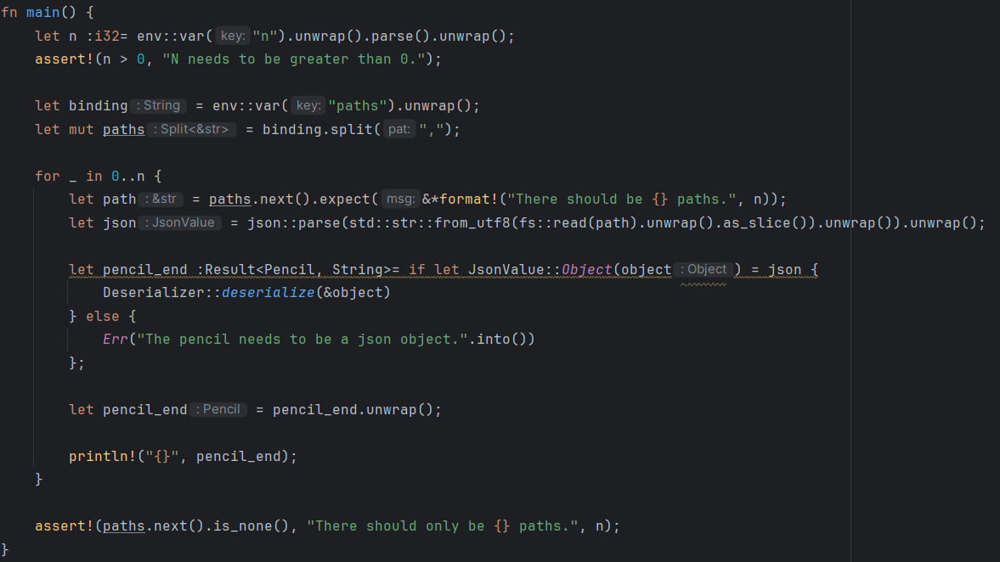
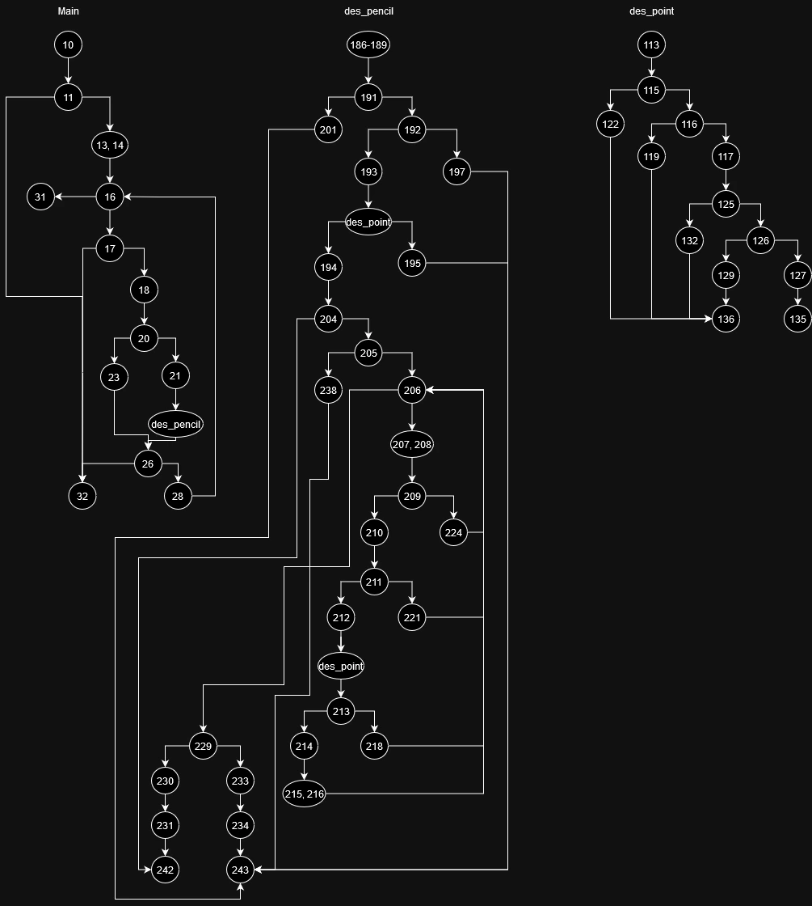
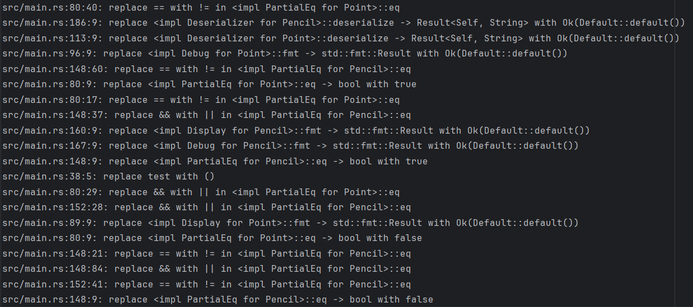

## Documentatie

### Framework folosit

Pentru acest proiect am folosit framework-ul oficial Rust[1]. Pentru a crea o suită de teste i se aplică modulului atributul „#[cfg(test)]”, iar funcțiilor atributul „#[test]”.

Un test eșuează atunci când programul panichează, fie direct apelând  „panic!”, fie folosind macro-uri precum „assert!”, care verifică o condiție sau funcții precum „unwrap”, care verifică dacă un obiect de tipul „Option” nu are valoarea „None”.

Dacă un test trebuie să eșueze, i se aplică atributul „#[should_panic({message})]”.

### Programul testat

Scopul programului este de a deserializa fișiere JSON care trebuie să conțină coordonatele unui punct, urmate de o listă de astfel de puncte(determină o traiectorie).

Am creat două structuri: „Point”(care ține două coordonate) și „Pencil”(care ține datele sub formă de puncte). Pentru deserializare am creat un trait cu funcția „deserialize” și l-am implementat pentru cele două structuri.

Programul principal citește numărul de fișiere și, pentru fiecare, încearcă să îl deserializeze. Se presupune că fișierele există.

### Testare funcțională

Parametrii programului  sunt:

- „n”, numărul de fișiere; acesta trebuie să fie strict mai mare decât 0; astfel, clasele de echivalență sunt (n < 0), (n > 0) și valorile de frontieră (n = 0) și (n = 1).
- „paths”, lista de nume a fișierelor; dimensiunea listei trebuie să fie egală cu n; clasele de echivalență sunt (len(p) < n), (len(p) = n) și (len(p) > n);
- fișierele în sine; acestea trebuie să aibă formatul corect JSON, și să aibă următoarea structură:
  {{“x”: /number/, “y”: /number/}, ([({“x”: /number/, “y”: /number/}), (...)])}; clasele de echivalență se
  diferențiază după existența și corectitudinea tipurilor de date ale câmpurilor „x” și „y” în puncte, și corectitudinea tipurilor de date din vector.

Toate configurațiile pentru testarea de categorie sunt prezentate în tabelul următor:

|   n   |  paths  |                  files                  |
|:-----:|:-------:|:---------------------------------------:|
| n < 0 |    -    |                    -                    |
| n = 0 |    -    |                    -                    |
| n = 1 | len < 1 |                    -                    |
| n = 1 | len > 1 |                    -                    |
| n = 1 | len = 1 |             "start" missing             |
| n = 1 | len = 1 |          "start" not an object          |
| n = 1 | len = 1 |            "x" not in point             |
| n = 1 | len = 1 |            "x" not a number             |
| n = 1 | len = 1 |            "y" not in point             |
| n = 1 | len = 1 |            "y" not a number             |
| n = 1 | len = 1 |       "offsets" needs to be array       |
| n = 1 | len = 1 | "offsets" needs to only contain objects |
| n = 1 | len = 1 |             value incorrect             |
| n = 1 | len = 1 |              value correct              |
| n > 1 | len = n |             "start" missing             |
| n > 1 | len = n |          "start" not an object          |
| n > 1 | len = n |            "x" not in point             |
| n > 1 | len = n |            "x" not a number             |
| n > 1 | len = n |            "y" not in point             |
| n > 1 | len = n |            "y" not a number             |
| n > 1 | len = n |       "offsets" needs to be array       |
| n > 1 | len = n | "offsets" needs to only contain objects |
| n > 1 | len = n |             value incorrect             |
| n > 1 | len = n |              value correct              |

### Testare structurală

Fiecare decizie depinde de o singură condiție, așa că testele generate după decizii sunt identice cu cele generate după condiții.

Arborele de decizie este structurat astfel(valoarea unui nod este linia din program):

### Testare cu mutații

Pentru această metodă de testare am folosit crate-ul „cargo-mutants”[2], care generează automat mutanți și testează pe suita de teste dacă aceasta va da la cel puțin un test un rezultat diferit. Când l-am rulat pe un test corect, atunci va detecta corect faptul că mutanții care modifică comparațiile cu „true” nu modifică rezultatul.

După ce am adăugat două teste care eșuează pentru valori greșite pe câmpurile „x” și „y”, singurul mutant rămas care nu modifică rezultatul este „replace main with ()”.

### Raport utilizare ChatGPT pentru generare de teste

Inițial i-am trimis codul din fișierul „main.rs”, după care am trimis următorul prompt:

„Please generate as many functional tests as you can for the algorithm I provided.”

Am primit batch-ul 1 de teste, care nu se concentra aproape deloc asupra conținutului fișierelor, ci doar a variabilelor „n” și „paths”.
Două dintre teste sunt eronate, deoarece unul dintre ele verifică dacă fișierul json are format valid(eu am presupus asta), iar celălalt verifică dacă „offsets” există(eu nu consider asta o eroare).

După aceea am trimis următorul prompt, pentru a încuraja o cantitate mai mare de teste:
„Give me 20 such examples for functional testing”.

Am primit batch-ul 2 de teste, care pe lângă cele inițiale verificau și conținutul fișierelor. ChatGPT tratează aceleași cazuri pe care le-am tratat în secțiunea de testare funcțională, cu excepția celor două teste eronate care erau și în primul batch.

În concluzie, ChatGPT a fost apt în generarea de teste. Un motiv probabil este faptul că algoritmul în sine este foarte clar în construcția lui(spre exemplu, nu există o decizie cu mai mult de o condiție).

### Referințe

- [1] https://doc.rust-lang.org/book/ch11-01-writing-tests.html, accesat la data de 12.05.2024;
- [2] https://mutants.rs/, accesat la data de 12.05.2024.

### Prezentare PowerPoint

Link: https://docs.google.com/presentation/d/10D8Vcthfr2GFiTlxP83KtAfPZxQz_-t36mxVGaQO5GQ/edit?usp=sharing